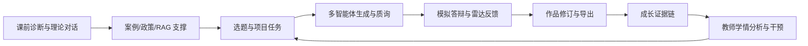

# 双创AI星际智能体平台：开发说明、国赛评审与海外部署建议

> 评审日期：2026 年 7 月 26 日  
> 参考文件：《全国高师院校教师教学智能体应用创新设计大赛通知》  
> 建议申报赛道：赛道二“学习赋能智能体”（本科组）  
> 评审范围：现有源代码、产品文档、本地运行页面和核心学习流程。未使用真实学生账号调用付费模型，因而 AI 生成质量、后台权限和真实统计数据仍需在正式测试账号下补验。

## 一、执行结论

“双创AI星际”已经不是概念原型，而是一个具备登录、学习资源、智能问答、多智能体协作、作品生成、模拟答辩、成长证据链和教师管理能力的完整教学平台。它最适合被定义为：

> 面向《创新创业基础》课程的学习赋能智能体，通过“理论学习—项目实践—多智能体质询—证据沉淀—教师干预”的人机协同闭环，帮助学生把双创知识转化为真实项目能力。

按大赛附件公布的五个评分维度进行严格预评，当前建议分数为 **72/100**。其水平大致属于“有较强二等奖竞争力，但尚未达到稳定冲击一等奖/特等奖”的阶段。

当前最大优势是产品完整、视觉记忆点强、智能体角色体系有差异化、教学证据链设计较新。最大短板不是功能，而是：

1. 缺少真实班级的前后测、使用率、教师减负、项目转化和用户反馈；
2. 参赛叙事过宽，容易被评委理解为“创赛工具箱”，而不是“教学智能体”；
3. 首页视觉层级复杂，实际检查中出现导航点击被星球交互吸收、已选模块“进入模块”未跳转的现象；
4. 数据出境、知情同意、第三方处理者、留存与删除机制目前以说明文字为主，缺少可验证执行证据；
5. 自动化测试、限流、监控、上传安全和备份恢复仍需工程加固。

若在报名截止前完成 P0 项，预期可以提升到 **84–88 分**。

## 二、网站开发说明

### 2.1 产品定位与用户

- 核心课程：《创新创业基础》。
- 主要用户：本科生、课程教师和教学管理员。
- 核心痛点：
  - 双创理论抽象，学生难以迁移到真实问题；
  - 选题、调研、商业模式和路演之间缺少连续训练；
  - 通用大模型缺少课程、赛事、区域产业和评分规则上下文；
  - 传统课程重最终 BP，轻过程能力证据；
  - 教师难以低成本识别学生差异并进行针对性干预。

### 2.2 产品结构

平台由“学习闯关”和“创新应用”两条主线构成。

学习闯关包括：

- 理论知识：创新思维、机会识别、商业模式、市场分析、团队组建、BP 与路演；
- 政策解读：国创、挑战杯、新文科、职业规划等赛事规则；
- 案例宝库：区域产业与双创案例；
- 模板宝库：BP、申报书、路演等模板；
- 平台直达：合规的学习和实践资源导流。

创新应用包括：

- 选题与赛道匹配；
- 商业计划书等文本生成与导出；
- PPT 大纲与可编辑文件生成；
- 模拟答辩和雷达评价；
- 专家审稿与整改建议；
- 多智能体“创业星舰”，由战略、产品、技术、商业、产业、导师、材料等角色协同；
- 成长星图，将关键产出、答辩评价、导出和干预记录沉淀为过程证据。

教师与管理端包括：

- 学生名单与权限管理；
- 知识库管理；
- 使用与成效统计；
- 学情观察和干预督导；
- 超星等教学平台对接入口。

### 2.3 核心教学流程

这一流程能够对应“诊断性评价—形成性评价—终结性评价”，也能体现教师、学生、智能体和同伴之间的协同。参赛时应重点展示这条闭环，而不是逐页介绍全部功能。

### 2.4 技术架构

- 前端与应用层：Next.js 14 App Router、React 18、TypeScript、Tailwind CSS、Framer Motion。
- 服务端：Next.js Route Handlers，AI、文件处理、积分、证据记录和管理操作均在服务端执行。
- 数据层：Supabase Auth + Postgres + pgvector + RLS。
- AI 层：通过 OpenAI 兼容网关调用聊天、推理、图像与嵌入模型；支持用户自有 API Key。
- RAG：文档抽取、向量化、Top-K 检索、来源回传和无检索结果降级。
- 多智能体：不同角色拥有独立职责、提示词和输出门槛，由总负责智能体统筹整合。
- 证据层：服务端记录选题、BP、专家审稿、答辩雷达、导出、技能使用和教师干预等事件；客户端不能伪造写入。
- 交付层：支持 Markdown、Word、PDF、轻量 PPTX，以及可选的 Presenton 商业 PPT 引擎。
- 部署层：项目已有多阶段 Dockerfile、standalone 构建和 docker-compose，适合 PaaS 或 Linux 云服务器。

### 2.5 安全与合规设计

现有设计已经包括：

- 登录鉴权和教师/管理员服务端权限门；
- 行级安全，学生只能访问自己的数据；
- 服务端密钥与前端公开密钥分离；
- 服务端原子扣积分，防止客户端刷分；
- 20 MB 文件大小与格式白名单；
- 网页抓取限制协议、内网地址和超时时间；
- AI 辅助而非替代、学术诚信、算法公平和数据最小化声明；
- 证据事件只允许服务端写入，数据库生成时间戳。

仍需补强：

- 接口级限流、用户/模型配额和异常调用熔断；
- Content-Security-Policy、严格安全响应头和日志脱敏；
- 文件内容嗅探、恶意文档扫描和图片大小限制；
- 网页抓取的 DNS 解析后私网校验、IPv6 私网校验、重定向后二次校验；
- 明确第三方模型、数据库和日志服务商清单；
- 可操作的数据导出、删除、撤回同意和自动到期清理；
- 备份恢复演练与安全事件响应流程。

## 三、运行检查结果

本地网站已重新启动并完成基础检查：

- 首页标题与品牌内容正常；
- 理论知识页正常呈现 6 个学习模块；
- “创新思维与方法”能够进入专属智能体对话界面；
- 对话页包含提示问题、附件上传、润色、发送和合规提示；
- 15 个主要路由均返回 HTTP 200；
- 未发现框架错误遮罩或前端报错；
- 控制台只有 Next.js 对固定定位元素自动滚动的提示性警告。

发现一项高优先级交互问题：

- 首页顶部“技能商店”点击后没有按预期跳转，而是触发了星球选择；
- 星球详情中的“进入模块”点击后页面保持在首页；
- 直接访问 `/learn/theory` 后，模块和对话入口工作正常。

这说明业务页面本身可用，但首页 Canvas/星球层与导航/详情层可能存在 z-index、pointer-events、事件冒泡或动效状态同步问题。国赛现场演示前必须修复并增加自动化回归测试。

## 四、国赛评委视角评分

大赛公布的评分标准为：合规与伦理 15 分、创新价值 20 分、技术实现 25 分、教学融合与应用设计 25 分、应用成效与推广价值 15 分。

| 维度 | 权重 | 当前得分 | 评委判断 |
|---|---:|---:|---|
| 合规与伦理 | 15 | **11** | 有独立合规页、RLS、服务端密钥、AI 责任边界和证据防伪，优于普通作品；但知情同意、删除执行、第三方清单、数据出境与安全审计证据不足。 |
| 创新价值 | 20 | **16** | “银河交互 + 动物智能体集群 + 真实案例 RAG + 答辩雷达 + 成长证据链”具有记忆点；但功能过多，核心教育创新范式尚未凝练为一个可复述、可验证的方法。 |
| 技术实现 | 25 | **19** | 架构完整，包含鉴权、RAG、pgvector、多智能体、文件解析、导出、Docker、教师端和防伪证据；扣分点是首页关键交互不稳、端到端 AI 未完全验收、缺少限流/监控/E2E/灾备证据。 |
| 教学融合与应用设计 | 25 | **21** | 能对应课前、课中、课后和竞赛孵化，并把过程产出回流教师，教学映射较强；但平台内的任务节奏、教师布置、评价量规和学生改进闭环还需要更显性。 |
| 应用成效与推广价值 | 15 | **5** | 有统计表、成长星图和推广思路，但现有说明中的班级数、学生数、前后测、满意度和获奖转化仍是空白，占比最高的真实证据尚未形成。 |
| **合计** | **100** | **72** | **具备较强二等奖竞争力；完成真实教学验证和演示主线整改后，可冲击一等奖。** |

### 评委可能追问的问题

1. 这究竟是教学智能体，还是学生创赛工具箱？
2. 与直接使用通用大模型相比，学习效果提升在哪里？
3. 多智能体是否只是角色提示词不同，协作机制如何被验证？
4. 学生成长雷达的数据从哪里来，是否能被提示词操纵？
5. 教师在系统中做了什么，AI 会不会替代教师判断？
6. 有多少真实学生使用，能力提升、教师减负和项目转化数据是多少？
7. 上传学生材料后会发送到哪些境外服务，是否取得知情同意？
8. 如果模型输出错误、失效或不可访问，课程如何继续？

答辩材料必须提前逐项准备证据，而不是只准备口头解释。

## 五、修改建议与优先级

### P0：报名与现场演示前必须完成

1. **收窄申报名称与主叙事**  
   建议申报名称使用“《创新创业基础》学习赋能智能体”，产品品牌“星际”作为体验层。开场 30 秒只讲一个闭环：学生诊断—项目任务—智能体质询—证据生成—教师干预。

2. **修复首页事件冲突**  
   检查 Canvas、星球、导航和详情面板的 z-index、pointer-events、事件冒泡与路由状态；为“技能商店、成长星图、进入模块、返回银河系”增加浏览器自动化测试。

3. **形成真实应用成效数据**  
   至少完成一个真实班级或两个平行小组的教学验证。建议采集：
   - 学生覆盖数、活跃率、完课率、人均有效对话轮次；
   - 选题质量、商业模式、证据使用、答辩表现 4 项前后测；
   - 首稿到终稿评分增量；
   - 教师批改/答疑时间变化；
   - 学生满意度和经过脱敏的典型反馈；
   - 进入校赛、省赛或项目孵化的数量。

4. **固化一条 8 分钟黄金演示路径**  
   演示账号登录 → 课前诊断 → 选题匹配 → 调用 2–3 个专家智能体 → 模拟答辩 → 查看成长星图 → 教师端看到干预建议。其余功能只在一张总览图上展示。

5. **把教学设计直接写进产品**  
   增加“教师任务—学生提交—AI 辅助—同伴互评—教师确认—二次修改”的任务状态；每个任务显示目标、量规、AI 使用要求和人工确认点。

6. **补齐合规执行证据**  
   首次登录增加知情同意；账户中心提供数据导出、删除与撤回；列出 Supabase、模型网关等第三方处理者和数据流向；建立到期删除任务并截图留证。

7. **准备双盲与测试材料**  
   公开 HTTPS 地址、测试账号、密码、权限和有效期必须稳定；页面、域名、Logo、案例、页脚、账号名和导出文件中不出现校名、院系、姓名和地名。

### P1：用于冲击一等奖

1. 给每条 RAG 回答展示可点击来源、资料版本和检索时间。
2. 将“答辩雷达”从单次 AI 主观打分升级为“量规评分 + 引用证据 + 教师确认 + 历次趋势”。
3. 增加教师课程驾驶舱：任务发布、完成率、共性误区、学生分层和干预闭环。
4. 明示多智能体工作流：每个角色输入、产出、驳回原因和最终人工确认点可追踪。
5. 做对照实验：通用大模型组、单智能体组、平台多智能体组，比较作品质量和学习迁移。
6. 优化无障碍与移动端：学习卡片改为语义化按钮，支持键盘操作、焦点样式和减少动效模式。

### P2：推广与商业化

1. 课程包可替换：知识库、任务、量规和案例按课程打包导入。
2. 多学校/多课程租户隔离，教师只能访问自己的课程数据。
3. 对接超星、雨课堂或学校统一身份认证。
4. 建立模型降级策略、国产模型切换和无 AI 静态教学兜底。
5. 建立 SLA、监控告警、每日备份和季度恢复演练。

## 六、海外服务器免 ICP 部署建议

### 6.1 合规边界

根据阿里云官方 ICP 文档，服务器位于中国大陆境外（包括香港等地区）时，一般不需要工信部 ICP 备案；但这不等于“没有任何合规义务”。如果网站面向中国大陆用户提供服务，仍应评估公安联网备案、个人信息保护、数据出境、教育数据管理和学校内部审批要求。

本平台会处理登录标识、对话、学习材料和教师评价。最稳妥的做法是采用“双环境”：

- **海外公开演示环境**：只使用测试账号、模拟数据和脱敏材料，用于比赛评审和产品展示；
- **真实教学环境**：如果尚未完成数据出境评估和知情同意，暂不把真实学生名册、作业、访谈原始数据放到海外。

### 6.2 首选方案：Render 新加坡 + Supabase 新加坡 + Cloudflare 域名

适合希望少运维、自动部署、尽快上线的团队。

- 网站：Render Web Service，选择 Singapore；
- 规格：正式演示建议 Standard，1 CPU / 2 GB RAM，约 **25 美元/月**；
- 数据库/Auth/向量：Supabase Pro，约 **25 美元/月**，项目选择新加坡区域；
- 域名与 DNS：Cloudflare Registrar（注册和续费按注册局成本，无额外加价）；
- HTTPS：Render 自定义域名自动证书；
- AI：APIMart/OpenAI 兼容网关费用按实际用量另计。

预算：

- 试运行：Render Starter 约 7 美元/月 + Supabase Free + 域名；
- 比赛稳定版：Render Standard 25 美元/月 + Supabase Pro 25 美元/月 + 域名 + AI，用量不大时基础设施约 **50–60 美元/月**。

优点：直接使用现有 Dockerfile，Git 推送自动部署，支持自定义域名，运维最轻。  
缺点：中国大陆访问速度受跨境网络影响；512 MB Starter 可能不足以稳定处理 Next.js、文档解析和多智能体长任务，因此正式比赛不建议最低规格。

### 6.3 性价比方案：AWS Lightsail 新加坡 2 GB + Supabase

- AWS Lightsail 新加坡 Linux 2 GB 套餐约 **12 美元/月**，包含 2 vCPU、60 GB SSD 和流量包；
- 服务器运行现有 Docker 镜像；
- 用 Caddy 或 Nginx 做 HTTPS 和反向代理；
- 数据库继续使用 Supabase Free/Pro，或后期自建。

优点：费用低、控制权高、能处理 20 MB 上传和较长 AI 请求。  
缺点：需要自行负责系统更新、Docker、证书、监控、备份、防火墙和故障恢复。

DigitalOcean 新加坡 2 GB Basic Droplet 同样约 12 美元/月，可作为同级替代。

### 6.4 不建议直接采用 Vercel 作为当前版本主方案

当前文件接口允许 20 MB 上传，而 Vercel Functions 官方限制请求/响应体最大 4.5 MB。除非先把上传改为“浏览器直传对象存储 + 服务端只接收文件地址”，否则会出现 413 错误。多智能体长任务还应改为流式响应或任务队列。因此当前代码更适合持续运行的 Docker Web Service 或 VPS。

### 6.5 推荐采购清单

1. 一个不含校名、地名和个人姓名的 `.com` 域名；
2. Render Singapore Standard，或 AWS Lightsail Singapore 2 GB；
3. Supabase Singapore Pro（比赛前至少一个月升级，避免免费项目暂停）；
4. Cloudflare DNS、DNSSEC；
5. 独立的演示账号和最小权限管理员账号；
6. 运行监控、错误告警、每日数据库备份；
7. 单独设置 AI 月度预算、积分上限和限流；
8. 比赛结束后按计划删除评委测试数据。

## 七、76 天整改节奏

大赛材料提交截止时间为 **2026 年 10 月 10 日 17:00**，距离本次评审约 76 天。

- 7 月 26 日—8 月 10 日：修首页交互、收窄主线、完成海外演示环境；
- 8 月 11 日—9 月 10 日：组织真实教学试用，采集前测、过程数据和教师反馈；
- 9 月 11 日—9 月 25 日：完成后测、对照分析、合规证据和平台截图；
- 9 月 26 日—10 月 3 日：压缩 5 页说明书、制作视频和测试账号说明；
- 10 月 4 日—10 月 8 日：按评委问题演练、全链路压测、双盲检查；
- 10 月 9 日：提前提交，保留一天处理上传或账号异常。

## 八、参考资料

- [大赛通知附件：全国高师院校教师教学智能体应用创新设计大赛通知](../05_参赛通知/全国高师院校教师教学智能体应用创新设计大赛通知.pdf)
- [Alibaba Cloud：境外服务器与 ICP 备案条件](https://www.alibabacloud.com/help/en/icp-filing/basic-icp-service/user-guide/icp-filing-server-access-information-check)
- [Render：支持新加坡区域](https://render.com/docs/regions)
- [Render：Web Service 与 Docker 部署](https://render.com/docs/web-services)
- [Render：实例规格](https://render.com/docs/compute-plans)
- [Supabase：当前定价与配额](https://supabase.com/pricing)
- [Cloudflare Registrar：域名按成本价注册与续费](https://developers.cloudflare.com/registrar/)
- [AWS Lightsail：2 GB Linux 套餐与价格](https://docs.aws.amazon.com/lightsail/latest/userguide/amazon-lightsail-bundles.html)
- [AWS Lightsail：新加坡区域](https://docs.aws.amazon.com/lightsail/latest/userguide/understanding-regions-and-availability-zones-in-amazon-lightsail.html)
- [DigitalOcean：Droplet 定价与新加坡机房](https://www.digitalocean.com/pricing/droplets)
- [Vercel：Functions 4.5 MB 请求体限制](https://vercel.com/docs/functions/limitations)

